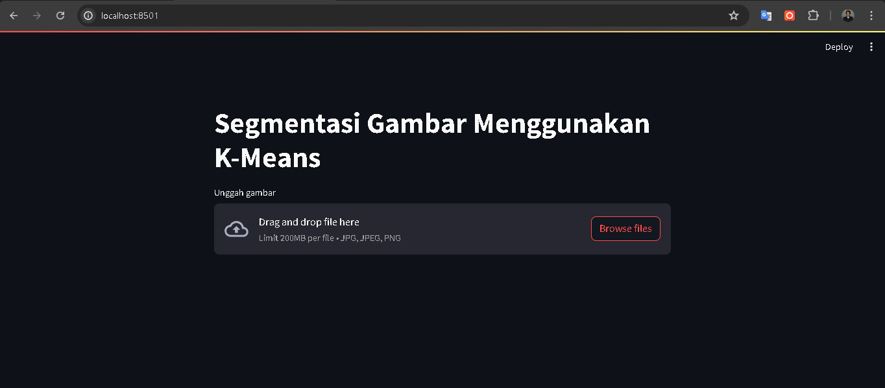

| Nama  |  Nim | Kelas |
| ------------- | ------------- |------------- |
| Mohammad Hapiyansyah  | 312210243 | TI 22 A2 |
| Mohammad Ryamizar Ryopa Sakti  | 312210185 | TI 22 A2 |
| Raja Heppyanto  | 312210235 | TI 22 A2 |

Laporan UAS Pengolahan Citra (PDF)

klik disini -> 

### Langkah-Langkah Menjalankan Aplikasi

1. **Clone atau Download Repository ini, lalu buka terminal dan jalankan perintah berikut:**
   ```bash
   git clone https://github.com/Hapiyansyah/UAS-PengolahanCitra.git
   ```
   ```
   cd UAS-PengolahanCitra
   ```
3. **Instal dependensi yang dibutuhkan dengan menjalankan perintah berikut di terminal:**
    ```bash
    pip install streamlit scikit-learn opencv-python pillow scipy
    ```

4. **Jalankan aplikasi Streamlit dengan perintah berikut:**
    ```bash
    streamlit run app.py
    ```
5. **Aplikasi Streamlit akan terbuka di browser Anda. Anda dapat mengunggah gambar, memilih jumlah cluster, dan melihat hasil segmentasi serta warna-warna yang ada beserta persentase.**

### Tampilan Aplikasi

1. **Tampilan Halaman**

